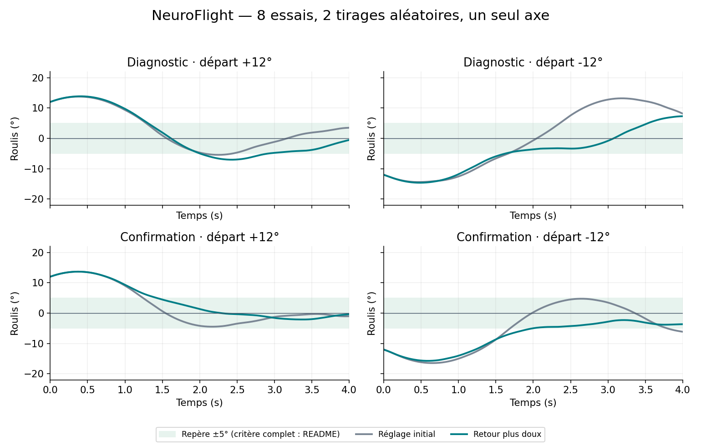
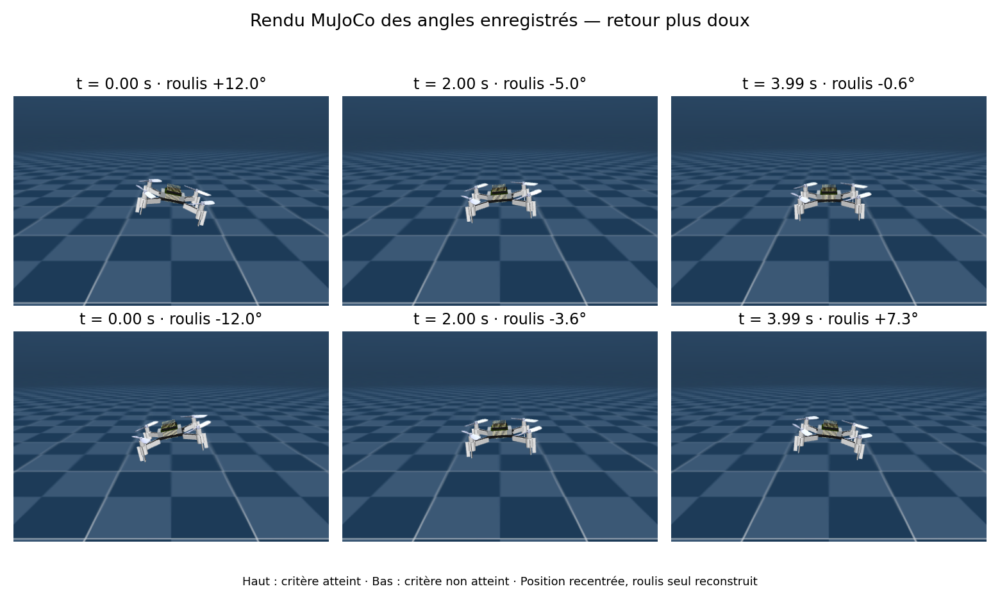

# NeuroFlight

**Explorer le redressement d'un drone simulé à partir d'un modèle neuronal de mouche.**

NeuroFlight relie un modèle de neurones impulsionnels construit à partir du connectome
**MaleCNS v1.0** à un Crazyflie simulé dans MuJoCo. Le projet cherche à transformer
l'activité neuronale en commandes de rotation utilisables par le drone.

**État actuel : expérience exploratoire sur le roulis, pendant 4 secondes.**
Des corrections utiles apparaissent, mais la stabilisation fiable et le vol sur trois
axes ne sont pas démontrés. Aucun essai sur drone physique n'est présenté ici.



## Ce qui fonctionne aujourd'hui

Les [huit essais enregistrés](results/roll_gain_comparison/README.md) comparent deux
réglages dans quatre situations : inclinaison initiale de ±12°, vitesse initiale de
±0,15 rad/s, deux tirages aléatoires. Le second tirage est distinct du diagnostic.
Le décodeur neuronal reste identique ; seul le coefficient de retour vers
l'horizontale passe de 2/s à 1/s.

| Mesure sur les quatre situations | Réglage initial | Retour plus doux |
|---|---:|---:|
| Moyenne des erreurs absolues de roulis sur les dernières 0,5 s | 4,56° | 3,35° |
| Situations satisfaisant le critère | 3/4 | 3/4 |

Le réglage plus doux réduit l'erreur dans trois comparaisons sur quatre. Il ne
démontre pas une meilleure fiabilité : le cas difficile échoue encore. Deux tirages
aléatoires ne permettent pas d'estimer un taux de réussite général.

**Critère exact :** terminer les 4 s sans franchir les bornes, obtenir un roulis
absolu moyen inférieur à 5° sur les dernières 0,5 s et une vitesse finale inférieure
à 0,2 rad/s en valeur absolue. Ce critère n'impose pas un angle final inférieur à 5°.
Les courbes ci-dessus montrent aussi les dépassements et les oscillations.

## Voir le drone



Ces vues utilisent le modèle Crazyflie de MuJoCo Menagerie et les angles réellement
enregistrés dans les essais. **La translation est recentrée et seul le roulis est
reconstruit** : il s'agit d'une relecture des attitudes, pas d'une capture d'un état
complet sauvegardé du simulateur. Le haut montre un cas qui satisfait le critère ;
le bas montre le cas qui échoue. Les courbes sont calculées directement à partir
des traces JSON, sans lisser les résultats.

## Quel « cerveau de mouche » ?


Vue anatomique du **système nerveux central mâle**, cerveau et chaîne nerveuse
ventrale : [MaleCNS, galerie officielle](https://male-cns.janelia.org/media/).
Crédit : FlyEM / HHMI Janelia, University of Cambridge, MRC Laboratory of Molecular
Biology et Google Research. Image et données sous
[CC BY 4.0](https://creativecommons.org/licenses/by/4.0/), image reproduite sans
modification et chargée depuis le site officiel. Ce visuel anatomique ne représente
pas l'activité de notre simulation.

MaleCNS est une collaboration scientifique, pas un réseau de pilotage fourni prêt
à l'emploi par Google. Il est distinct du connectome FlyWire du cerveau femelle.
Notre cache conserve 165 122 neurones annotés « Traced » et 6 235 682 connexions
après filtrage à au moins cinq synapses. Ces nombres décrivent le cache utilisé,
pas l'intégralité du jeu de données source.

## Comment les neurones commandent le drone

1. Le simulateur fournit l'inclinaison et la vitesse de rotation.
2. Un adaptateur encode `vitesse + coefficient × inclinaison` en activité sensorielle.
3. Le modèle LIF propage cette activité dans les connexions MaleCNS.
4. Un décodeur lit dix traces de neurones moteurs et estime une commande de correction.
5. Cette commande filtrée devient un couple de roulis appliqué dans MuJoCo.

Le modèle neuronal est la source de la commande de roulis dans ces essais. En
revanche, **la référence d'horizontalité, l'encodage sensoriel, la conversion en
couple et le maintien d'altitude sont des choix d'ingénierie**. La fidélité au
réflexe biologique de redressement n'est pas démontrée. Le câblage anatomique ne
suffit pas à garantir que les paramètres LIF reproduisent la physiologie.

## Installation

Environnement de référence : **Python 3.12**, Linux. Depuis la racine du dépôt :

```bash
python -m venv .venv
source .venv/bin/activate
python -m pip install -r requirements.txt
```

Les versions sont celles des essais ; leur détail est aussi conservé dans
[environment.json](results/roll_gain_comparison/environment.json).

### Lire les résultats sans télécharger le connectome

```bash
python -m scripts.report_roll_gain_comparison
python -m unittest scripts.test_readout_v2 scripts.test_roll_adapter
```

Les résultats, coefficients et traces sont déjà versionnés. Les vérifications ne
nécessitent pas le cache neuronal ; le modèle Crazyflie est fourni par Menagerie.

### Reproduire les simulations

```bash
# Télécharge environ 1,1 Go de données officielles et construit le cache local.
python -m scripts.download_malecns_data --build-cache

# Diagnostic, puis confirmation avec un autre tirage aléatoire.
OPENBLAS_NUM_THREADS=1 python -m scripts.roll_gain_comparison
OPENBLAS_NUM_THREADS=1 python -m scripts.roll_gain_comparison --confirmation
python -m scripts.report_roll_gain_comparison
```

Les scripts réutilisent les essais terminés si leur empreinte correspond au
protocole. **Pour recalculer plutôt que relire les fichiers fournis**, déplacer
`results/roll_gain_comparison` vers un dossier de sauvegarde avant les deux commandes
de simulation. Le script recrée le dossier. Conserver les données de calibration
dans `results/readout_v2` et le décodeur dans `results/roll_closed_loop_pilot_robust`.
Exécuter les commandes depuis la racine. Un essai neuronal peut prendre bien plus
de temps que ses quatre secondes simulées.

### Recréer les illustrations

```bash
python -m pip install -r requirements-media.txt
python -m scripts.render_readme_media --plots-only
# Linux avec EGL disponible, pour les vues MuJoCo :
MUJOCO_GL=egl python -m scripts.render_readme_media
```

Les figures ne nécessitent pas le connectome. En l'absence d'EGL, utiliser les
courbes seules ou les images déjà présentes. Le script ne régénère pas l'image
anatomique externe ; ses crédits figurent dans [les attributions](THIRD_PARTY_NOTICES.md).

## Organisation du dépôt

| Dossier | Rôle |
|---|---|
| `flybrain/` | Modèle LIF et chargement du connectome |
| `scripts/` | Expériences actuelles, préparation des données, rapports et vérifications |
| `results/` | Données de calibration, protocoles et résultats conservés, y compris les échecs |
| `docs/` | Guide du code, provenance des illustrations et images |
| `archive/` | Anciens prototypes PPO, démonstrations et diagnostics hors du parcours principal |

Les fichiers historiques encore importés par les essais restent à leur chemin
d'origine pour préserver leurs empreintes et leur reproductibilité. Le
[guide du code](docs/REPOSITORY_GUIDE.md) explique lesquels. Les
[archives](archive/README.md) conservent les essais précédents sans les présenter
comme des expériences validées. L'[index des résultats](results/README.md)
distingue les séries complètes des séries interrompues.

## Poursuite du travail

- Réduire les oscillations et la variabilité sans court-circuiter la sortie neuronale.
- Étendre les essais à davantage de tirages, à de nouvelles perturbations et à des durées plus longues.
- Comparer systématiquement avec une entrée sensorielle déconnectée et un contrôleur classique.
- N'aborder les trois axes qu'après une validation plus robuste du roulis.

## Licence et sources

Le code original de NeuroFlight est sous [licence MIT](LICENSE).
Les données et images tierces conservent leurs propres licences ; voir
[THIRD_PARTY_NOTICES.md](THIRD_PARTY_NOTICES.md).

- [MaleCNS : projet et données](https://male-cns.janelia.org/)
- [Téléchargements MaleCNS](https://male-cns.janelia.org/download/)
- [Google Research : présentation du connectome mâle](https://research.google/blog/a-connectomics-milestone-mapping-the-complete-male-fruit-fly-brain/)
- [MuJoCo Menagerie : Crazyflie 2](https://github.com/google-deepmind/mujoco_menagerie/tree/main/bitcraze_crazyflie_2)

Projet indépendant ; aucune affiliation ni validation par ces équipes n'est revendiquée.
